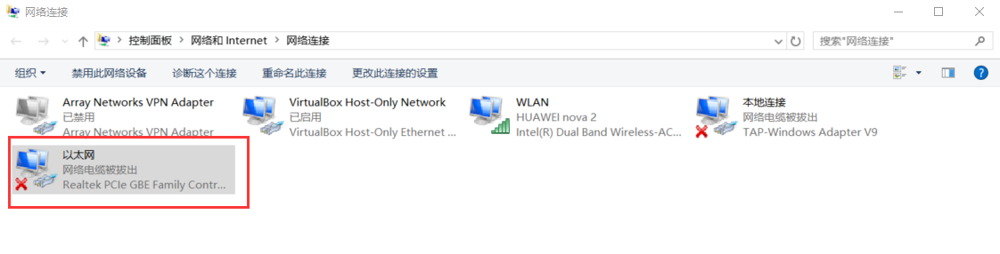
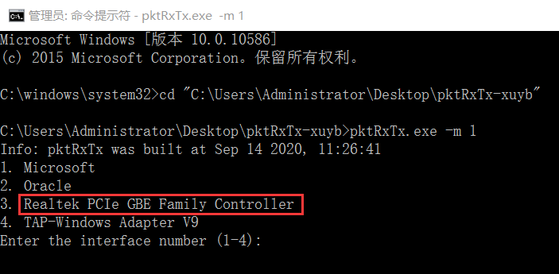
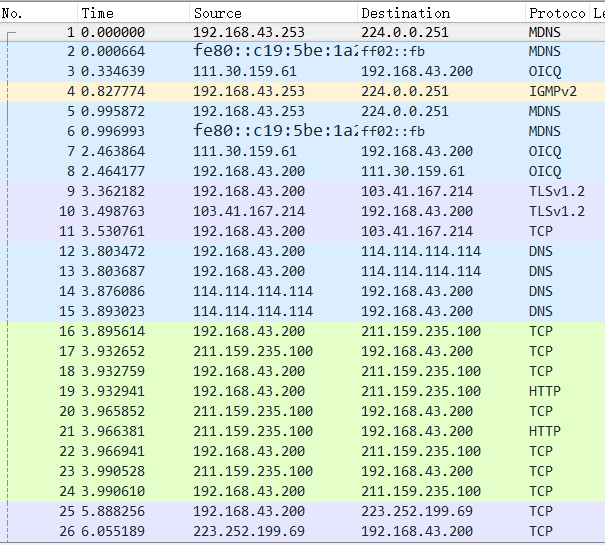
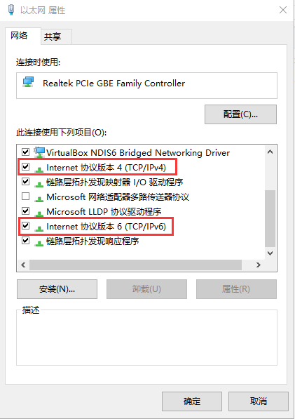
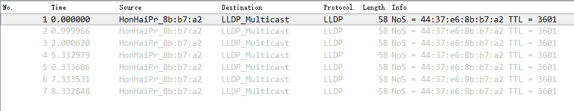
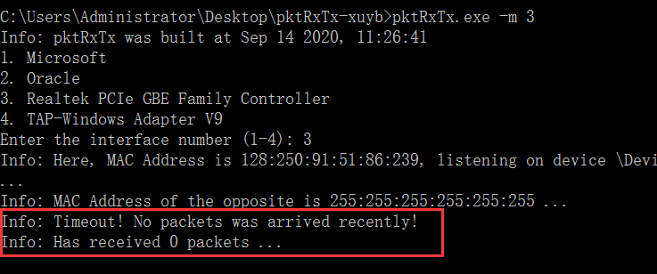

## pktRxTx使用说明

### 一、项目简介：

&emsp; pktRxTx程序可以监听网卡、单向/双向收发数据包，兼容Windows、Linux、MacOS平台，用于国科大本科《操作系统实验课》网卡实验的辅助教学。

&emsp; 如果您在使用中遇到任何问题，请通过邮箱(<i>xuyibin17@mails.ucas.ac.cn</i>)联系作者。

### 二、环境配置：

#### （一）Linux/MacOS版：

&emsp; 对于Linux/MacOS系统，<b>在使用前需要安装libpcap和libnet第三方库</b>，其中libpcap库的安装方法可以参考 https://blog.csdn.net/qq_21792169/article/details/52496796 。

&emsp; 压缩包中的Linux/MacOS可执行文件pktRxTx可以在管理员权限下直接运行（需要检查文件的执行权限是否已启用）。如果想重新编译的话，可以使用make命令进行编译。

#### （二）Windows版：

&emsp; 对于Windows系统，<b>在使用前需要安装WinPcap库和WpdPack开发包</b>，其中WinPcap的安装文件详见https://www.winpcap.org/install/default.htm ，WpdPack包含在pktRxTx-Windows文件夹内。

&emsp; 压缩包中的Windows可执行文件pktRxTx.exe可以在管理员权限下的CMD中直接运行（鼠标右击开始菜单，点击“命令提示符（管理员）”）。如果想重新编译的话，可以使用cmake和make命令进行编译，编译前需要安装MinGW-w64编译工具链。

<!-- &emsp; <b>注意：若Windows机器上缺少必要的库文件，可能会报出“缺少XXX.dll文件”的错误。这里建议大家安装Visual Studio来快速补足必要的库文件。</b> -->

### 三、使用方法：

#### （一）选择适配器：

&emsp; 在网卡实验中，板卡和主机通过网线相连，因此选择适配器应该选择<b>以太网适配器</b>。

&emsp; 例如在Windows环境下，可以通过“网络和共享中心->更改适配器设置”来查看以太网对应的网络适配器，在下图中可以看到机器上的以太网适配器是“Realtek PCIe GBE Family Controller”，因此在pktRxTx程序主界面中选择上述适配器。

#### （二）命令行选项：

<b>-h</b>：打印help信息，并退出程序；

<b>-m [mode]</b>：设置运行时模式，pktRxTx支持如下的四种模式：

* <b>MODE_SEND</b>(1)：该模式下，程序将会启动一个交互界面，可以在其中执行“send”、“test"和“quit”命令。其中，“send”命令将会向板卡端发送指定数目的数据包；“test”命令将会在指定时间内，向板卡端高速发送大量的数据包。

* <b>MODE_SEND_RECEIVE</b>(2)：该模式下，用户需要在命令行参数中指定发包的数目。程序启动之后将会向板卡端发送数据部分为“Requests: %d”的一系列数据包，同时等待板卡端发送过来的数据包（其中%d代表序列号，即该数据包为第几号数据包，编号从0开始）。对于板卡端而言，此时需要接收主机pktRxTx发过来的数据包，<b>并将数据部分替换为“Response: %d”之后，</b>回送给主机端pktRxTx。<b>注意：这里的序列号将会被用于判断是否丢包，因此序列号需要保持不变！</b>

* <b>MODE_RECEIVE</b>(3)：该模式下，程序将会持续监听网卡，如果网卡上有新的数据包到来的话，将会被程序读取并记录到收包个数中。

* <b>MODE_RECEIVE_SEND</b>(4)：该模式下，程序收到板卡端发送而来的数据包之后，将会修改源和目的MAC地址，然后将数据包回送给板卡端。该模式在目前的实验中尚未用到，仅用于MODE_SEND_RECEIVE的调试。

* <b>MODE_SEND_RELIABLE</b>(5)：该模式下，程序会发送使用可靠传输层协议的数据包，前8个字节为报头。如果没有指定文件，将自动生成并发送源源不断的字符串数据。

* <b>MODE_RECV_RELIABLE</b>(6)：该模式下，程序使用可靠传输层协议接收并处理数据包。该模式在目前的实验中尚未用到，仅用于MODE_SEND_RELIABLE的调试。

<b>-n [num_pkts]</b>：指定发送数据包的个数，用于MODE_SEND_RECEIVE；

<b>-p [pkt_interval]</b>：指定接收线程每接收多少个数据包打印一次结果，用于MODE_RECEIVE、MODE_SEND_RECEIVE和MODE_RECEIVE_SEND，默认值为1；

<b>-t [seconds]</b>：设置发包的时间间隔，学生无须设置，使用默认值即可；

<b>-w [num_bytes]</b>：设置发送方的发送窗口大小，用于MODE_SEND_RELIABLE，默认值为10000；

<b>-f [path_to_file]</b>：指定传输的文件路径，用于MODE_SEND_RELIABLE；

<b>-l [probability]</b>：设置模拟丢包率为[probability]/100，用于MODE_SEND_RELIABLE，默认值为0；

<b>-s [probability]</b>：设置模拟数据包乱序比例为[probability]/100，用于MODE_SEND_RELIABLE，默认值为0；

#### （三）示例运行命令：

* 发包：sudo ./pktRxTx -m 1，表示使用模式1（发包模式），进入交互界面后使用send和test命令；

* 发送-接收：sudo ./pktRxTx -m 2 -n 32，表示使用模式2（发送-接收模式）向对端发送32个包后，等待对方将这些包回传过来；

* 接收：sudo ./pktRxTx -m 3，表示使用模式3（接收模式）。

* 可靠发送：sudo ./pktRxTx -m 5 -l 10 -s 50，表示使用模式5（可靠发送模式），有10%的丢包和50%的乱序包。

### 四、一些注意点:

#### （一）减少杂音包的方法：

&emsp; 在我们用网线连接板卡的时候，如果没有采取必要操作的话，那么以太网信道中将会充斥着如下图所示的大量杂音包，这些杂音包将会给我们的实验带来较大的干扰。

&emsp; 一种去除杂音包干扰的方法是在同学们自己的实验代码中增加判断逻辑，只有当判断出数据包是pktRxTx发送过来的，才能进行转发等操作，但这种方法较为复杂。所以为了减少同学们的工作量，我们推荐大家采用如下的第二种“偷懒的”方法：

&emsp; 如下图所示，Windows环境下在网络适配器设置中打开以太网适配器，<b>关闭ipv4和ipv6的服务</b>即可。Linux/MacOS找到以太网适配器之后同样操作。这样做可以显著减少杂音包的数量，让我们的以太网信道变得更加“整洁”。

&emsp; 然而这样仍然无法消除一些来自板卡loadboot时发送的数据包（如下图所示），因此，<b>在板卡上启动接收测试程序之前，一定要确保这些数据包已经完全发送完毕才能启动接收测试程序</b>！！！

#### （二）退出接收线程

&emsp; 为防止杂音包的干扰，pktRxTx的接收线程设计为持续接收，不会自然停止，但同时也引入了一个计时器线程来查看当前是否有新的数据包到来。所以当屏幕中出现下所示的Timeout信息时，即表示当前没有新数据包到来，可以使用Ctrl+C来退出程序。

<!-- ### 五、项目下一步计划（预计会更新到2022年的实验课中）

* 使用cmake重构一下项目的结构以及编译流程。

* 使用Npcap替换掉已经deprecated的WinPcap。

* 根据课程的需求，进一步添加/修改项目的功能。 -->

<!-- ### 六、附录

&emsp; 如果同学们想通过Visual Studio使用pktRxTx-Windows的源代码从头搭建一个VS工程项目的话，<b>项目属性</b>中需要修改的地方如下所示（假设WinPcap文件夹与.sln解决方案文件放置在同级目录下）：

* 常规-目标文件名：pktRxTx

* 调试-命令参数：-m 1（这里可参照第三部分进行自定义）

* VC++目录-包含目录：增加.\Include和..\WinPcap\4.1beta3-WpdPack\Include

* VC++目录-库目录：增加..\WinPcap\4.1beta3-WpdPack\Lib

* C/C++-预处理器-预处理器定义：增加HAVE_REMOTE、WPCAP、WIN32、_CRT_SECURE_NO_WARNINGS、WIN32_LEAN_AND_MEAN

* 链接器-输入-附加依赖项：增加ws2_32.lib和wpcap.lib

* 链接器-清单文件-UAC执行级别：requireAdministrator -->
